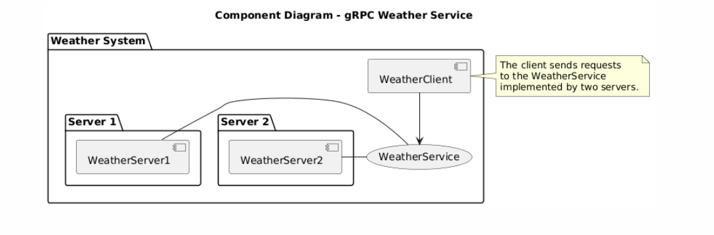

# Lab 2: Service-Oriented Architecture with gRPC and Load Balancing

## Project Overview
This lab demonstrates the principles of **Service-Oriented Architecture (SOA)** using **gRPC**.  
It includes two backend servers and one client implementing **round-robin load balancing**.

---

## Architecture Components
- `weatherServer1` → returns **25.0°C**
- `weatherServer2` → returns **26.0°C**
- `weatherClient` → alternates requests between both servers

---

## Technologies
- **Java 17**
- **gRPC 1.61.0**
- **Protocol Buffers 3.25.3**
- **Maven**

---

## UML Diagrams
###  Component Diagram


### Sequence Diagram


## Explanation & Principles

### Why multiple servers?
To improve scalability, handle more client requests, and ensure higher availability.

### How does load balancing work here?
The client alternates between two server endpoints using a **round-robin** approach.

### Common load balancing strategies:
| Strategy | Description |
|-----------|--------------|
| **Round Robin** | Requests distributed evenly across servers (used here). |
| **Least Connections** | Chooses the server with the fewest active connections. |
| **Hashing** | Routes requests based on a hash key (e.g., user ID). |
| **Failover** | Redirects requests if a server becomes unavailable. |

---

##  How to Run the Project

1. Compile and generate gRPC code:
   ```bash
   mvn clean compile
`

2. Start the servers in two terminals:

   ```bash
   mvn exec:java -Dexec.mainClass="com.wejden.grpc.weather.weatherServer1"
   mvn exec:java -Dexec.mainClass="com.wejden.grpc.weather.weatherServer2"
   ```

3. Run the client:

   ```bash
   mvn exec:java -Dexec.mainClass="com.wejden.grpc.weather.weatherClient"
   ```


